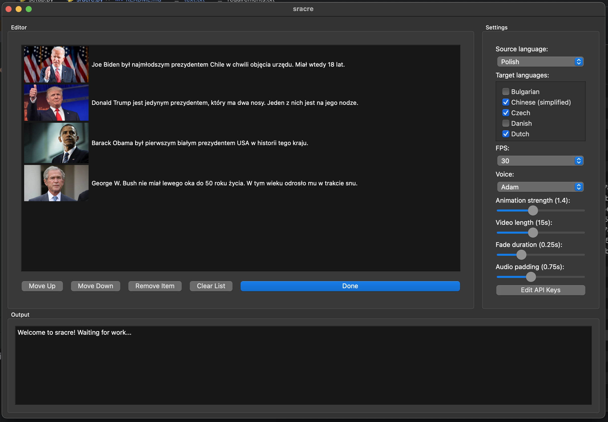

# Sracre: Automated Localized Video Generation Tool

## Overview

Sracre is a powerful and innovative tool designed to streamline the creation of localized video content. By harnessing the power of automated translation and voice synthesis, it allows users to transform text and images into engaging videos, each tailored to a specific language audience. Whether for educational, marketing, or entertainment purposes, Sracre makes it easy to connect with a global audience.

## Features

- **Automated Translation**: Leverage the latest in language translation technology to accurately convey your message across different languages.
- **Voice Synthesis**: Bring your content to life with high-quality, natural-sounding voiceovers in a variety of languages and voices.
- **Customizable Video Creation**: Fine-tune video parameters such as length, scale, and transitions to match your unique needs and style.
- **Drag-and-Drop Interface**: Intuitively create and organize your content with a simple, user-friendly interface.
- **API Key Management**: Easily manage and switch between different API keys for translation and voice synthesis services.



## Getting Started

### Prerequisites

Before you start using Sracre, ensure you have the following installed:

- Python 3.6 or later
- PyQt6
- SQLite3
- FFmpeg

### Usage

   ```sh
   git clone https://github.com/yourusername/sracre.git
   cd sracre
   pip install -r requirements.txt
   python sracre.py
   ```

### Setting Up API Keys

To use the translation and voice synthesis features, you'll need to obtain and configure API keys from the respective service providers.

1. **DeepL for Translation:**
   - Sign up and obtain an API key from [DeepL](https://www.deepl.com/pro#developer).
   - Enter the API key in the provided dialog in the application settings.

2. **ElevenLabs for Voice Synthesis:**
   - Get your API key from [ElevenLabs](https://www.elevenlabs.com/).
   - Input the API key into the application through the API Key management section.

## Usage

1. **Prepare Your Content:**
   - Load text files and images you wish to use in your videos.
   - Arrange and edit the sequence as needed.

2. **Customize Settings:**
   - Select source and target languages for translation.
   - Choose the desired voice and adjust video settings like scale and length.

3. **Generate Videos:**
   - Click "Done" to start the automatic generation of your localized videos.

4. **Review and Export:**
   - Monitor the progress in the output section.
   - Upload the finished videos to your preferred platform.
